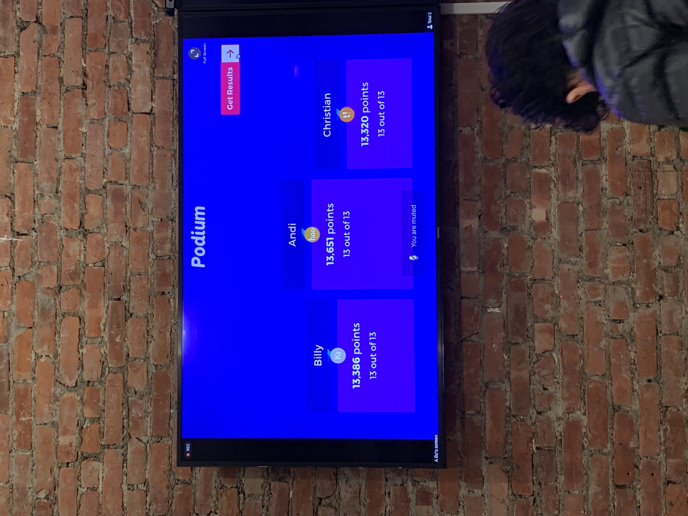

VueNYC April Meetup

## VueNYC April Meetup

This meetup is not a technical meetup, but a community get-together.

In the first half of the meetup, we talked about community. There was nothing about programming. We shared our understanding of concepts such as **community** and **belonging**.

An open source community does not equal to a repository on GitHub or some other platform. It is a community where people have a sense of belonging.

In the second half there came a technical talk, which is about styling components in Vue.js. As a developer using Vue.js frequently, I learned a lot of useful techniques in this talk.

There was also a talk on negotiating with employers, which was also useful.

Finally there was a game. Questions were all things talked during the meetup. I won a prize in the game.

Open source meetups are places where I can meet interesting people. I learned new things not only from talks given by lecturers, but also from conversations with other community members. Participating open source meetups gives me a sense of belonging to the open source community.
